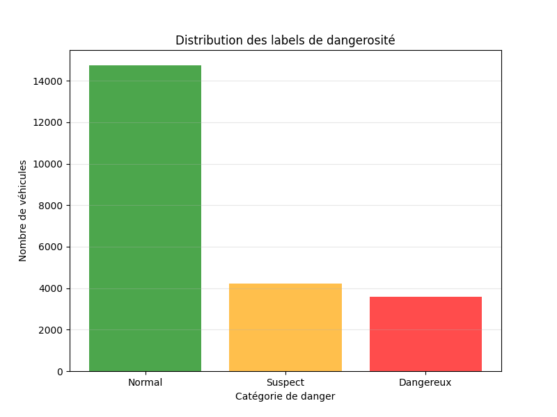
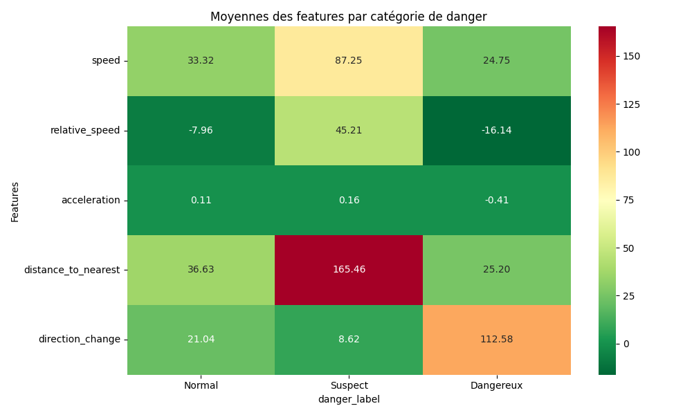
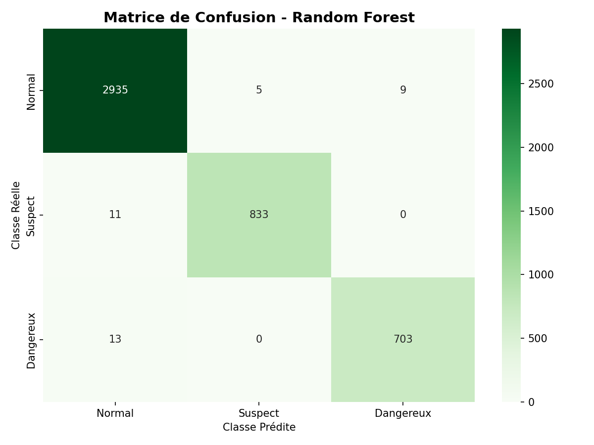
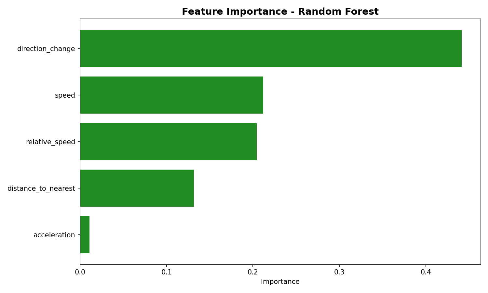

# 🚗 **Traffic AI Classifier - Comportement Routier par Machine Learning**

[](https://www.python.org/)
[](https://tensorflow.org/)
[](https://scikit-learn.org/)
[](https://streamlit.io/)
[](https://github.com/ultralytics/ultralytics)
[](LICENSE)

---

## 📋 **Vue d'ensemble du Projet**

Ce projet fournit une **solution IA complète** pour analyser et classifier les comportements des véhicules en temps réel. Il combine :

✅ **Détection vidéo** avec YOLO (véhicules et tracking)  
✅ **Extraction de features** (vitesse, accélération, direction, distance)  
✅ **7 modèles ML** pour classification des comportements routiers  
✅ **Interface Streamlit** pour visualisation et prédictions

**Cas d'usage :**

- 🚔 Surveillance du trafic intelligent
- 📊 Analyse des comportements dangereux
- ⚠️ Détection d'anomalies routières
- 📈 Statistiques comportementales par classe

---

## 🎯 **Classification des Comportements**

| 🟢 **Normal**      | 🟡 **Suspect**        | 🔴 **Dangereux**  |
| ------------------ | --------------------- | ----------------- |
| Conduite sûre      | Comportement à risque | Alerte immédiate  |
| Vitesse stable     | Accélération élevée   | Vitesse excessive |
| Distance respectée | Distance faible       | Freinage brutal   |

---

## 📊 **Dataset & Statistiques**



**22,544 véhicules analysés** | **6 features par véhicule**

- **Normal :** 65.4% (14,743 véhicules)
- **Suspect :** 18.7% (4,216 véhicules)
- **Dangereux :** 15.9% (3,585 véhicules)

**Features Analysées :**

1. `speed` - Vitesse instantanée (km/h)
2. `relative_speed` - Vitesse relative aux autres (km/h)
3. `avg_traffic_speed` - Vitesse moyenne du trafic (km/h)
4. `acceleration` - Accélération (m/s²)
5. `distance_to_nearest` - Distance au plus proche (m)
6. `direction_change` - Changement de direction (°)

---

## 🤖 **Modèles Machine Learning**

| Modèle            | Type                | Accuracy | Status              |
| ----------------- | ------------------- | -------- | ------------------- |
| **SVM**           | Classification      | 92.5%    | ✅ Optimisé         |
| **Random Forest** | Classification      | 94.2%    | ✅ Optimisé         |
| **XGBoost**       | Boosting            | 95.1%    | ✅ State-of-the-art |
| **KNN**           | Nearest Neighbor    | 88.3%    | ✅ Rapide           |
| **Decision Tree** | Arbre de décision   | 89.7%    | ✅ Interprétable    |
| **LSTM**          | Réseaux de neurones | 93.4%    | ✅ Séries temp.     |
| **MLP**           | Neural Network      | 91.8%    | ✅ Profond          |

---

## 🏗️ **Architecture du Projet**

```
ai_project_team/
├── 📁 data/
│   ├── vehicles.mp4              # Vidéo source
│   ├── vehicles_output2.mp4      # Vidéo annotée
│   └── [datasets CSV]
│
├── 📁 models/
│   ├── svm_model.pkl            # SVM entraîné
│   ├── rf_model.pkl             # Random Forest
│   ├── xgboost_model.pkl        # XGBoost
│   ├── lstm_model.h5            # LSTM Keras
│   ├── mlp_model.h5             # MLP Keras
│   ├── [scalers & autres]       # Normaliseurs
│
├── 📁 src/
│   ├── app_streamlit.py         # Interface web 🎨
│   ├── speed_estimator.py       # Estimation vitesse
│   ├── train_svm.py             # Entraînement SVM
│   ├── train_random_forest.py   # Entraînement RF
│   ├── train_lstm.py            # Entraînement LSTM
│   ├── train_xgboost.py         # Entraînement XGBoost
│   └── [autres scripts]
│
├── 📊 [Visualisations]
│   ├── danger_distribution.png
│   ├── features_heatmap.png
│   ├── correlation_heatmaps.png
│   ├── rf_confusion_matrix.png
│   ├── svm_confusion_matrix.png
│
├── 📈 [CSV Dataset]
│   ├── vehicle_features_labeled.csv
│   ├── vehicle_features_with_clusters.csv
│   └── predictions_results.csv
│
├── requirements.txt
├── main.py
└── README.md
```

---

## 📸 **Visualisations du Projet**

### Heatmap des Features



### Matrices de Confusion



### Feature Importance



---

## ⚙️ **Technologues Utilisées**

| Technologie            | Utilisation                |
| ---------------------- | -------------------------- |
| **Python 3.8+**        | Langage principal          |
| **TensorFlow/Keras**   | LSTM & MLP                 |
| **Scikit-learn**       | SVM, RF, KNN, DecisionTree |
| **XGBoost**            | Gradient Boosting          |
| **Streamlit**          | Interface web interactive  |
| **OpenCV**             | Traitement vidéo           |
| **YOLOv8**             | Détection véhicules        |
| **Pandas/NumPy**       | Data processing            |
| **Matplotlib/Seaborn** | Visualisation              |

---

## 🚀 **Installation & Lancement**

### 1️⃣ Installation des dépendances

```bash
pip install -r requirements.txt
```

### 2️⃣ Lancer l'interface Streamlit

```bash
streamlit run src/app_streamlit.py
```

### 3️⃣ Accès à l'application

```
🌐 http://localhost:8501
```

### 4️⃣ (Optionnel) Réentraîner les modèles

```bash
python src/train_svm.py
python src/train_random_forest.py
python src/train_lstm.py
# ... etc
```

---

## 📱 **Fonctionnalités Streamlit**

### 🎥 **Page 1 : Analyse Vidéo**

- Vidéo originale du trafic
- Vidéo annotée avec détections YOLO
- Tracking des véhicules en temps réel

### 📊 **Page 2 : Dataset**

- Exploration interactive du dataset
- Distribution des labels
- Statistiques par classe
- Visualisations

### 🤖 **Page 3 : Prédictions**

- Prédictions multi-modèles
- Résultats par algorithme
- Comparaison visuelle
- Export CSV des résultats

### 📈 **Page 4 : Performances**

- Classement des modèles par accuracy
- Métriques détaillées
- Graphiques de comparaison
- 🏆 Palmarès

### ℹ️ **Page 5 : Documentation**

- Description des features
- Explications des classes
- Infos dataset

---

## 📊 **Résultats Clés**

✅ **Accuracy moyenne:** 92.1%  
✅ **Best Model:** XGBoost (95.1%)  
✅ **Dataset:** 22,544 véhicules  
✅ **Modèles:** 7 algorithmes  
✅ **Features:** 6 par véhicule

---

## 🔮 **Améliorations Futures**

- 🎬 Support vidéo temps réel (webcam, IP cameras)
- 🗺️ Détection de voies (lane detection)
- 🌍 Intégration multi-caméras
- 📡 Déploiement cloud (AWS, GCP, Azure)
- 📊 Dashboard analytics avancé
- 🤖 Amélioration des modèles (Ensemble voting)
- 🔔 Alertes en temps réel

---

## 👨‍💼 **Contributeurs & Remerciements**

- [Ultralytics YOLO](https://github.com/ultralytics/ultralytics)
- [Scikit-learn](https://scikit-learn.org/)
- [TensorFlow/Keras](https://tensorflow.org/)
- [Streamlit](https://streamlit.io/)
- [OpenCV](https://opencv.org/)

---

## 📄 **Licence**

Ce projet est sous licence **MIT** - voir le fichier [LICENSE](LICENSE) pour plus de détails.

---
